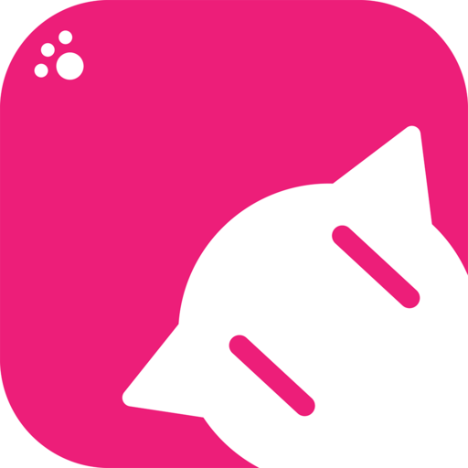

# YumikoToys

<p align="center">
  
</p>

<p align="center">
  <strong>一款现代化的 macOS 桌面宠物与 AI 助手应用</strong>
</p>

<p align="center">
  
  
  
  
</p>

---

## ✨ 功能特性

### 🐾 桌面宠物
- **像素风格头像** - 可爱的像素艺术风格宠物形象
- **宠物人设系统** - 为宠物创建独特的性格、背景和说话风格
- **状态栏驻留** - 宠物常驻状态栏，随时互动

### 🤖 AI 助手
- **多模型支持** - 支持 GLM、NVIDIA 等多种 AI 提供商
- **本地模型** - 支持 MLX 本地模型运行
- **多对话管理** - 独立的多对话历史记录
- **流式响应** - 实时流式输出 AI 回复
- **思考过程可视化** - 展示 AI 的思考过程

### 🎯 智能功能
- **网络搜索** - 集成 Tavily 搜索服务
- **文件分析** - 支持多种文档格式解析
- **图片分析** - AI 视觉理解能力
- **纪念日管理** - 重要日期提醒

### 🎨 用户界面
- **原生 SwiftUI** - 遵循 macOS Human Interface Guidelines
- **现代卡片式设计** - 简洁优雅的视觉体验
- **自适应布局** - 响应式窗口布局
- **深色模式支持** - 自动适配系统主题

---

## 📋 系统要求

- macOS 14.0 (Sonoma) 或更高版本
- Xcode 15.0 或更高版本
- Swift 5.9+

---

## 🚀 快速开始

### 克隆项目

```bash
git clone https://github.com/your-username/YumikoToys.git
cd YumikoToys
```

### 打开项目

```bash
open YumikoToys.xcodeproj
```

### 构建运行

1. 在 Xcode 中选择 `YumikoToys` scheme
2. 点击运行按钮 (⌘R) 或使用菜单 `Product > Run`

---

## 📁 项目结构

```
YumikoToys/
├── App/                    # 应用入口与生命周期
│   └── YumikoToysApp.swift
├── Core/                   # 核心服务与工具
│   ├── AppState.swift      # 全局状态管理
│   ├── DependencyContainer.swift
│   ├── FontManager.swift
│   └── StatusBarManager.swift
├── Models/                 # 数据模型
│   ├── AIProvider.swift    # AI 提供商模型
│   ├── PetPersona.swift    # 宠物人设模型
│   ├── Conversation.swift  # 对话模型
│   └── ...
├── Services/               # 服务层
│   ├── Implementations/    # 服务实现
│   │   ├── GLMService.swift
│   │   ├── WebSearchService.swift
│   │   └── ...
│   └── Protocols/          # 服务协议
├── Views/                  # 视图层
│   ├── Components/         # 可复用组件
│   ├── Main/               # 主视图
│   ├── Modifiers/          # 视图修饰器
│   └── StatusBar/          # 状态栏视图
├── Assets/                 # 资源文件
│   ├── Assets.xcassets/    # 图片资源
│   └── Fonts/              # 自定义字体
└── YumikoToysTests/        # 单元测试
```

---

## 🏗️ 架构设计

### MVVM 架构
项目采用 **MVVM (Model-View-ViewModel)** 架构模式：

- **Model**: 值类型 `struct`，遵循 `Identifiable`/`Codable`
- **ViewModel**: `@MainActor class`，使用 `@Published` 发布状态
- **View**: SwiftUI 视图，通过 `@StateObject` 持有 ViewModel

### 依赖注入
使用 `DependencyContainer` 管理服务依赖：

```swift
// 服务注册
DependencyContainer.shared.register(GLMService.self, instance: glmService)

// 服务获取
let glmService = DependencyContainer.shared.resolve(GLMService.self)
```

### 并发编程
采用 Swift Concurrency (async/await)：

```swift
Task { @MainActor in
    await initializeApp()
}
```

---

## 🔧 配置说明

### AI 提供商配置

在 `APISettings` 中配置 AI 服务：

```swift
var apiSettings = APISettings()
apiSettings.glmAPIKey = "your-glm-api-key"
apiSettings.nvidiaAPIKey = "your-nvidia-api-key"
```

### 支持的 AI 模型

| 提供商 | 模型 | 特性 |
|--------|------|------|
| GLM | glm-4, glm-4-plus | 工具调用、长上下文 |
| GLM | glm-4v | 视觉理解 |
| NVIDIA | 各种模型 | 高性能推理 |

---

## 🧪 测试

运行单元测试：

```bash
# 在 Xcode 中
⌘U

# 或使用命令行
xcodebuild test -scheme YumikoToys -destination 'platform=macOS'
```

---

## 📝 开发规范

### 命名规范
- 清晰优先于简洁，避免缩写
- 无副作用用名词短语，有副作用用动词短语
- 布尔属性读起来像断言：`isEmpty`, `hasPrefix`

### 代码风格
- 遵循 [Swift API Design Guidelines](https://swift.org/documentation/api-design-guidelines/)
- 使用 `Logger` 进行日志记录
- UI 更新必须在主线程 (`@MainActor`)

---

## 🤝 贡献指南

欢迎贡献代码！请遵循以下步骤：

1. Fork 本仓库
2. 创建功能分支 (`git checkout -b feature/amazing-feature`)
3. 提交更改 (`git commit -m 'feat: add amazing feature'`)
4. 推送到分支 (`git push origin feature/amazing-feature`)
5. 创建 Pull Request

### Commit 规范

使用 [Conventional Commits](https://www.conventionalcommits.org/) 规范：

- `feat:` 新功能
- `fix:` Bug 修复
- `docs:` 文档更新
- `style:` 代码格式
- `refactor:` 代码重构
- `test:` 测试相关
- `chore:` 构建/工具

---

## 📄 许可证

本项目采用 MIT 许可证 - 详见 [LICENSE](LICENSE) 文件

---

## 🙏 致谢

- [SwiftUI](https://developer.apple.com/xcode/swiftui/) - Apple 现代化 UI 框架
- [GLM](https://open.bigmodel.cn/) - 智谱 AI 大语言模型
- [Tavily](https://tavily.com/) - AI 搜索 API

---

<p align="center">
  Made with ❤️ by YumikoToys Team
</p>
